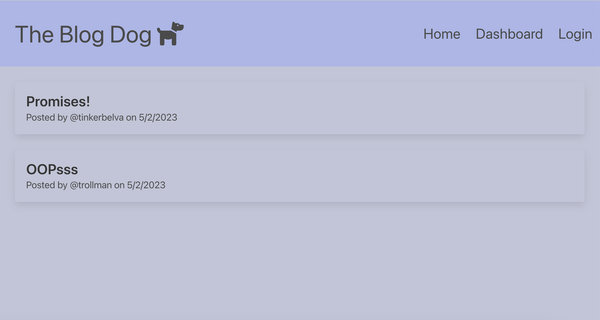

# blogging-dog-app

## Description 
The Blog Dog is a Full-Stack web development application that allows users to create, manage, and share their blog posts. Built on Node.js and the Model-View-Controller (MVC) architecture, the application uses several technologies such as Express, MySQL2, Sequelize, Bcrypt, Handlebars, Express-Handlebars, Express-Session, Connect-Session-Sequelize, and JavaScript. With its responsive design using Bulma for styling, the Blog Dog is user-friendly and works on any device.

My motivation for creating this application was to gain hands-on experience with web development and learn more about database management, authentication, and the MVC paradigm.

## Features
The Blog Dog features an intuitive interface for creating, reading, updating, and deleting blog posts. Users can create an account, log in, and access their dashboard to manage their posts. The application includes user authentication and security features such as hashed passwords using Bcrypt and session management using Express-Session and Connect-Session-Sequelize.

Apart from blogging functionality, users can also comment on posts they find interesting and enjoy the conversations.

## Usage 
To get started with The Blog Dog, simply visit the deployed application at [The Blog Dog](https://obscure-ravine-61875.herokuapp.com/). You can create a new account or log in to an existing one. Once logged in, you can manage your posts, add comments, and interact with other users. The Blog Dog is fully responsive and mobile-friendly, making it accessible from any device.

## How to Contribute 
If you have any questions or want to contribute, please email me at elva.rothman.developer@gmail.com. I welcome feedback and appreciate your help in improving the application.